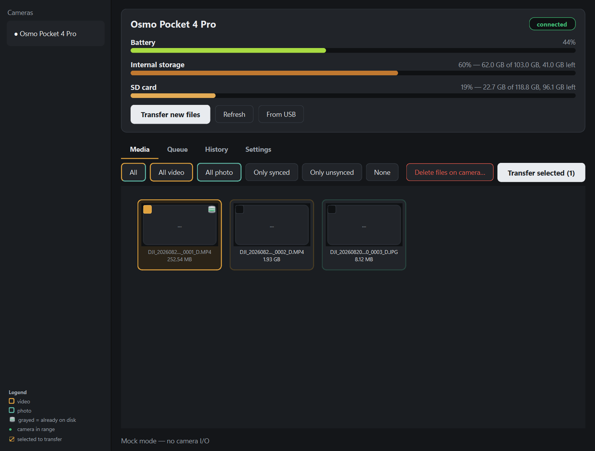

# Osmo Offload

Get photos and videos off a DJI Osmo camera and onto a Windows PC, wirelessly. No phone, no cable, no DJI account.

DJI's built-in wireless transfer only talks to their phone app, which is a dead end if you shoot on an Osmo and edit on a desktop. This is a small standalone utility that fills that gap: it wakes the camera over Bluetooth, joins the camera's own WiFi network and pulls your files at full wireless speed (60+ MB/s on a Pocket 4 Pro over 5 GHz). Power the camera on, click Transfer, done.



## What it does

- One click transfers everything new; a thumbnail grid lets you cherry-pick instead
- Shows battery and storage (internal + SD card) while connected
- Optional auto-transfer whenever the camera comes in range
- Downloads are resumable and hash-verified, with a transfer history so nothing gets pulled twice
- Writes a session report (HTML + CSV) of what landed where, including per-clip length and resolution
- "Delete files on camera" for footage that's confirmed safe on disk, with a very loud warning if you select something that isn't
- USB ingest through the same pipeline for the days you do grab a cable
- Tray mode, dated folder structure per camera, naming templates, an after-transfer command hook, update check

Built and verified on the DJI Osmo Pocket 4 Pro. The protocol layer sticks to the paths that are documented as common across the recent Osmo line (Action 5/6, Nano, Pocket 3), so other bodies have a decent chance of just working. If you try one, let me know either way.

## Install

Grab `OsmoOffload-Setup-<version>.exe` from [Releases](../../releases) and run it. It installs per-user (no admin prompt), "Start with Windows" is a checkbox, and uninstalling from Windows Settings works like you'd expect. Your transfer history and settings live in `%APPDATA%\OsmoOffload` and survive reinstalls.

Prefer no installer? The bare `OsmoOffload.exe` from the same release runs standalone.

## Requirements

- Windows 10/11
- Bluetooth LE and 5 GHz-capable WiFi on the PC (a cheap combo card does fine)
- A DJI Osmo camera

On first run a short wizard checks your radios and walks through pairing. The camera shows an approval prompt on its screen exactly once.

## How it works

[KonradIT/osmosis](https://github.com/KonradIT/osmosis) documents DJI's unpublished DUML protocol in remarkable detail. Osmo Offload is a Windows implementation of it: Bluetooth LE wakes and pairs the camera (the camera then hands over its WiFi credentials by itself), a UDP datalink delivers the file list plus battery/storage status, and the files come down over plain HTTP from the camera's own access point. That AP has no internet, and Windows happily keeps your real connection on Ethernet next to it, so nothing else on your PC notices a transfer is running.

## Build from source

```
py -3.13 -m venv .venv
.venv\Scripts\python -m pip install -e .[dev] pyinstaller
.venv\Scripts\python -m pytest
powershell -ExecutionPolicy Bypass -File scripts\build.ps1
```

The build script produces both the standalone exe and the Inno Setup installer (needs [Inno Setup 6](https://jrsoftware.org/isinfo.php), e.g. `winget install -e --id JRSoftware.InnoSetup`).

For protocol tinkering there are CLI scripts in `scripts/`: `probe.py` (BLE pairing + credentials), `wake_and_join.py` (AP bring-up), `list_media.py` (datalink + media list) and `offload.py` (headless transfer).

## Credits

The heavy lifting here was the reverse engineering, and that is the work of [Konrad Iturbe](https://github.com/KonradIT) in [osmosis](https://github.com/KonradIT/osmosis), together with the projects it builds on: [dji-remote](https://github.com/dimadesu/dji-remote), [osmo-download](https://github.com/SemiConscious/osmo-download), [DJI-Wifi-Connect](https://github.com/sniffingpickles/DJI-Wifi-Connect), [lib-osmo-ble](https://github.com/yigitkonur/lib-osmo-ble), [dji_protocol](https://github.com/samuelsadok/dji_protocol), [reverse-engineering-dji](https://github.com/xaionaro/reverse-engineering-dji) and the [DJI OGs](https://github.com/o-gs). Without that documentation this tool would not exist. A couple of Pocket 4 Pro protocol details found during development (handle geometry, the short still-image record marker) were confirmed against real hardware here and are described in the commit history.

## License and disclaimer

MIT, see [LICENSE](LICENSE).

This is an independent project, not affiliated with, authorized or endorsed by DJI. "DJI" and "Osmo" are trademarks of their respective owners. The delete function only ever touches files it has verified on your disk, and asks twice about anything else, but ultimately: your footage, your responsibility.
